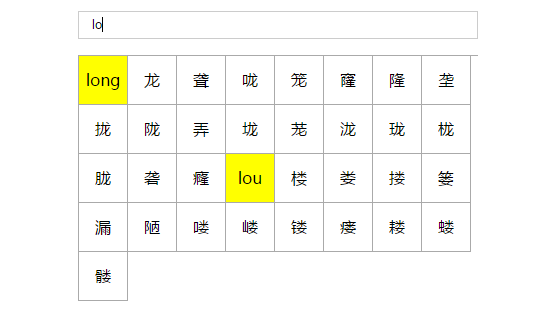

# pinyinchazi
根据拼音查询汉字 

 
1. 加载js文件 \<script src="js/pinyin.js"\>\</script\> 
2. 调用查询方法<code>searchCharactorByPinyin('lo',true)</code><code>searchCharactorByPinyin('long')</code>
 如果不带关键字true,将默认从上一次查询结果中查询，带true时从全量查询，SO，首次查询务必带true。
